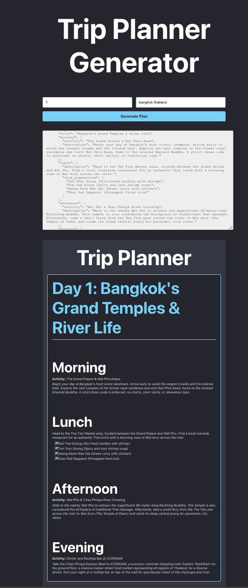

# Travel Plan Generator

A full-stack application that uses the Google Gemini API to generate personalized travel itineraries. Users can input a country and the number of days for their trip, and the application will produce a detailed, day-by-day plan, including a calendar view.

## URL

- Frontend: https://lseg-th.github.io/trip-planner/
- Backend: https://trip-planner-lbspb4jy1-klogics-projects.vercel.app/api/generate-plan

## Screenshot

Here is what the application looks like when you generate a 3-day plan for Thailand:



## About The App

This project was created to demonstrate a practical use case for large language models (LLMs) in a full-stack web application. It combines a simple, user-friendly React frontend with a robust Node.js backend that securely communicates with the Google Gemini API.

### Features

- **AI-Powered Itineraries**: Leverages the Gemini API to generate creative and detailed travel plans.
- **Simple User Interface**: Two simple inputs for country and duration.
- **Structured Calendar View**: Displays the generated plan in an easy-to-read, day-by-day calendar format.
- **Raw JSON Output**: Shows the raw JSON response from the AI for debugging or other uses.
- **Full-Stack Architecture**: Built with a React frontend and a Node.js/Express backend.

## Tech Stack

- **Frontend**: React.js
- **Backend**: Node.js, Express.js
- **API**: Google Gemini API (`@google/generative-ai`)
- **Styling**: CSS

## Prerequisites

Before you begin, ensure you have the following installed:

- Node.js and npm (v16 or higher recommended)
- A **Google Gemini API Key**. You can obtain one from Google AI Studio.

## Project Setup

Follow these steps to get your development environment set up.

1.  **Clone the repository** (if you haven't already):

    ```bash
    git clone <your-repository-url>
    cd <repository-folder>
    ```

2.  **Set up the Backend**:

    - Navigate to the `backend` directory:
      ```bash
      cd backend
      ```
    - Install the required npm packages:
      ```bash
      npm install
      ```
    - Copy the example environment file to create your own local environment file.
      ```bash
      cp .env.example .env
      ```
    - Open the new `.env` file and add your personal Google Gemini API key.

3.  **Set up the Frontend**:
    - From the root directory, navigate to the `frontend` directory:
      ```bash
      cd ../frontend
      ```
    - Install the required npm packages:
      ```bash
      npm install
      ```

## How to Develop

You will need to run two separate terminal sessions: one for the backend and one for the frontend.

1.  **Start the Backend Server**:

    - In a terminal, navigate to the `/backend` directory and run:
      ```bash
      npm start
      ```
    - The server will start on `http://localhost:5001`.

2.  **Start the Frontend Application**:
    - In a second terminal, navigate to the `/frontend` directory and run:
      ```bash
      npm start
      ```
    - The React development server will open the application in your browser, usually at `http://localhost:3000`.

The application is now running! You can enter a number of days and a country to generate your travel plan.
